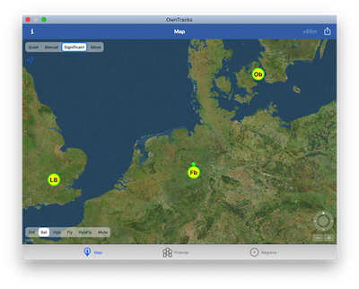

# ocli


This is the OwnTracks command line interface publisher, a.k.a. _ocli_, a small utility which connects to _gpsd_ and publishes position information in [OwnTracks JSON](https://owntracks.org/booklet/tech/json/) to an MQTT broker in order for [compatible software](https://owntracks.org/booklet/guide/clients/) to process location data. (Read up on [what OwnTracks does](https://owntracks.org/booklet/guide/whathow/) if you're new to it.)

### gpsd

[gpsd] is a daemon that receives data from one or more GPS receivers and provides data to multiple applications via a TCP/IP service. GPS data thus obtained is processed by _ocli_ and published via [MQTT].


We've been successful with a number of GPS receivers, some of which are very affordable. The small USB stick receiver in the above photo is called a VK172 and costs roughly €16.

Determining which USB port was obtained by the receiver can be challenging, but _dmesg_ is useful to find out. Once you know the port, cross your fingers that it remains identical after a reboot, and ensure your _gpsd_ service is running. For testing, we've found that launching it from a terminal is useful:

```console
$ gpsd -n -D 2 -N /dev/tty.usbmodem1A121201
```
### ocli

_ocli_ operates with a number of defaults which you can override using environment variables.

The following defaults are used:

- The MQTT base topic defaults to `owntracks/<username>/<hostname>`, where _username_ is the name of the logged in user, and _hostname_ the short host name. This base topic can be overridden by setting `BASE_TOPIC` in the environment.
- The MQTT host and port are `localhost` and `1883` respectively, and can be set using `MQTT_HOST` and `MQTT_PORT`.
- The MQTT clientId is set to `"ocli-<username>-<hostname>"`, but it can be overridden by setting `OCLI_CLIENTID` in the environment.
- TCP is used to connect to _gpsd_ with `localhost` and `2947` being the default host and port, overridden by setting `GPSD_HOST` and `GPSD_PORT`.
- The two-letter OwnTracks [tracker ID](https://owntracks.org/booklet/features/tid/) can be configured by setting `OCLI_TID`; it defaults to not being used.
- `OCLI_INTERVAL` defaults to 60 seconds.
- `OCLI_DISPLACEMENT` defaults to 0 meters.
- TLS can be enabled for the MQTT connection by specifying the path to a PEM CA certificate with which to verify peers in `OCLI_CACERT`. Note, that you'll likely need to also specify a different `MQTT_PORT` from the default.

_ocli_ reads GPS data from _gpsd_ and as soon as it has a fix it publishes an OwnTracks payload (see below). _ocli_ will subsequently publish a message every `OCLI_INTERVAL` seconds or when it detects it has moved `OCLI_DISPLACEMENT` meters.



#### payload

Any number of path names can be passed as arguments to _ocli_ which interprets each in terms of an element which will be added to the OwnTracks JSON. The element name is the base name of the path. If a path points to an executable file the first line of _stdout_ produced by that executable will be used as the _key_'s _value_, otherwise the first line read from the file. In both cases, trailing newlines are removed from values.

```console
$ echo 27.2 > parms/temp
$ ocli parms/temp contrib/platform
```

In this example, we use a file and a program. When _ocli_ produces its JSON we'll see something like this:

```json
{
  "_type": "location",
  "tst": 1577654651,
  "lat": 48.856826,

  "temp" : "27.2",
  "platform": "FreeBSD"
}
```

Note that a _key_ may not overwrite JSON keys defined by _ocli_, so for example, a file called `lat` will not be accepted as it would clobber the latitude JSON element.

#### controlling ocli

It is possible to control _ocli_ using a subset of OwnTrack's `cmd` commands.

```console
$ t=owntracks/jpm/tiggr/cmd
$ mosquitto_pub -t $t -m "$(jo _type=cmd action=reportLocation)"
```
The following commands are currently implemented:

- `reportLocation` causes _ocli_ to publish its current location (providing _gpsd_ has a fix). _ocli_ sets `t:m` in the JSON indicating the publish was manually requested.
- `dump` causes _ocli_ to publish its internal configuration to the topic `<basetopic>/dump` as a `_type: configuration` message.

	```json
	{
	  "_type": "configuration",
	  "_npubs": 47,
	  "clientId": "owntracks-ocli",
	  "locatorInterval": 60,
	  "locatorDisplacement": 0,
	  "pubTopicBase": "owntracks/jpm/tiggr",
	  "tid": "OC",
	  "username": "jpm",
	  "deviceId": "tiggr"
	}
	```

- `setConfiguration` permits setting some of _ocli_'s internal values. Note that these do not persist a restart.

    ```console
    $ mosquitto_pub -t $t -m "$(jo _type=cmd action=setConfiguration configuration=$(jo _type=configuration locatorInterval=10 locatorDisplacement=0))"
    ```

	```json
	{
	  "_type": "cmd",
	  "action": "setConfiguration",
	  "configuration": {
	    "_type": "configuration",
	    "locatorInterval": 10,
	    "locatorDisplacement": 0
	  }
	}
	```


### building

_ocli_ should compile easily once you extract the source code and have the prerequisite libraries installed for linking against _gpsd_ and the _mosquitto_ library.

Systems we've tested on require the following packages in order to build _ocli_.

#### FreeBSD

```console
# pkg install mosquitto gpsd
$ make
```

#### OpenBSD

```console
# pkg_add mosquitto gpsd
$ make
```

#### macOS

```console
$ brew install mosquitto gpsd
$ make
```

#### Debian

```console
# apt-get install libmosquitto-dev libgps-dev
$ make
```

#### CentOS

```console
# yum install openssl-devel
$ wget https://mosquitto.org/files/source/mosquitto-1.6.8.tar.gz
$ tar xf mosquitto-1.6.8.tar.gz
$ cd mosquitto-1.6.8/
$ make
# make install
# echo /usr/local/lib > /etc/ld.so.conf.d/mosquitto.conf
# ldconfig

# yum install python3-scons
$ wget http://download-mirror.savannah.gnu.org/releases/gpsd/gpsd-3.19.tar.gz
$ tar xf gpsd-3.19.tar.gz
$ cd gpsd-3.19/
$ /usr/bin/scons-3
# /usr/bin/scons-3 udev-install

$ cd ocli
$ make
```

#### systemd

This may be a way of getting _ocli_ working on machines with _systemd_. Basically we need two things:

1. an environment file, `ocli.env`:

	```
	name="Testing"
	fixlog="/tmp/fix.log"
	BASE_TOPIC="m/bus/b001"
	MQTT_HOST="localhost"
	MQTT_PORT=1888
	GPSD_HOST="localhost"
	GPSD_PORT="2947"
	OCLI_TID="OC"
	```

2. a systemd Unit file:

	```
	[Unit]
	Description=OwnTracks cli
	Requires=mosquitto.service

	[Service]
	Type=simple
	EnvironmentFile=/home/jpm/ocli.env
	ExecStartPre=/usr/bin/touch /tmp/ocli-started-${name}
	ExecStart=/home/jpm/bin/ocli
	Restart=always
	RestartSec=60
	User=mosquitto
	Group=mosquitto

	[Install]
	WantedBy=multi-user.target
	```


### Credits

- Idea and initial implementation by [Jan-Piet Mens](https://jpmens.net)
- [gpsd]
- [mosquitto](https://mosquitto.org)
- [utarray](https://troydhanson.github.io/uthash/utarray.html)
- [utstring](https://troydhanson.github.io/uthash/utstring.html)

  [gpsd]: https://gpsd.gitlab.io/gpsd/
  [mqtt]: http://mqtt.org
